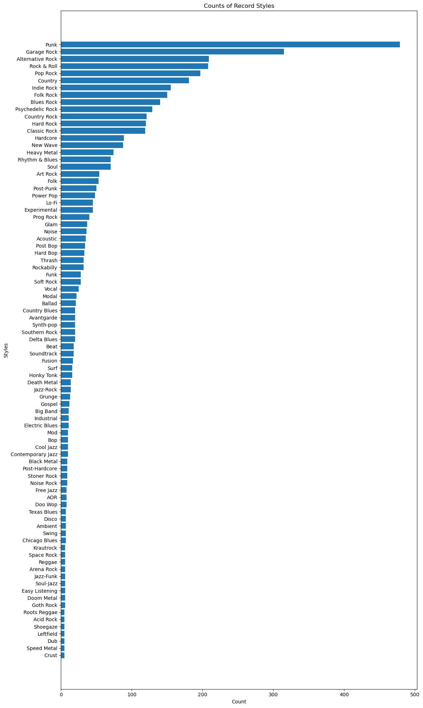
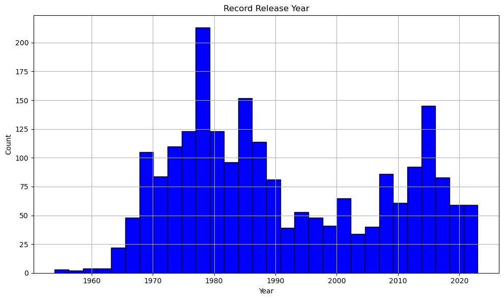
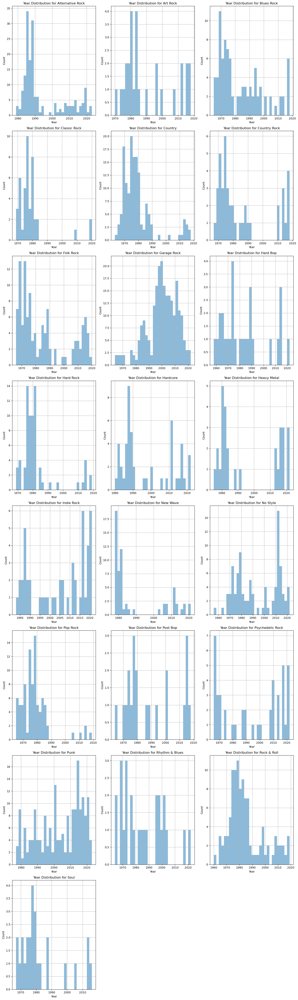
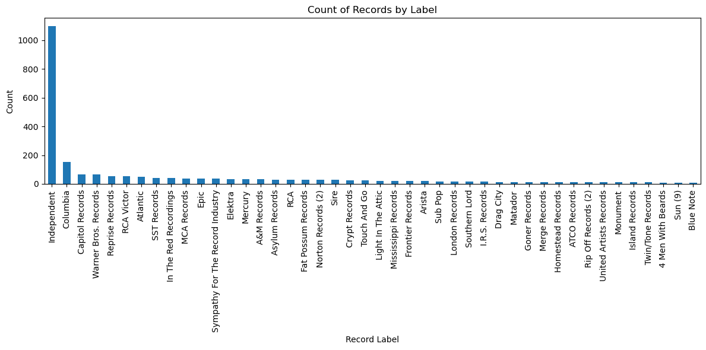

## Final Project Report: DTSC 5301

My name is Lucas Derr and my domain presentation was on the music industry. For this project I will be analyzing my Dad's large record collection and extracting insights from it. My dad has documented his entire collection on [Discogs](https://www.discogs.com), an online record collection marketplace/hub. [Here](https://www.discogs.com/user/hackerofslop) is a link to his account. I will use the API to load his collection into memory and try to extract insights from it.


```python
import requests
import pandas as pd
from collections import Counter
from itertools import chain
import matplotlib.pyplot as plt
```


```python
token = "RGNNFOqGfjbHiQYPkFesuijUilrAOMEKorYTcVbv"  # I asked my Dad to generate a token for his account
username = 'hackerofslop'
api_url = f'https://api.discogs.com/users/{username}/collection/folders/0/releases?per_page=100&sort=artist'


headers = {
    'Authorization': f'Discogs token={token}'
}
all_albums = []
page = 1

while True:
    api_url = f'https://api.discogs.com/users/{username}/collection/folders/0/releases?page={page}'
    
    response = requests.get(api_url, headers=headers)
    
    if response.status_code == 200:
        
        data = response.json()

        albums_on_page = data['releases']
        
        all_albums.extend(albums_on_page)

        # Discogs uses pagination, so we have to iterate through his collection page by page
        if 'pagination' in data and 'urls' in data['pagination']:  
            
            if "next" not in data['pagination']['urls']:
                break  # No more pages to fetch
            else:
                next_page_url = data['pagination']['urls']['next']
        else:
            break  # Pagination information is missing
    else:
        print(f"Request failed with status code: {response.status_code}")
        break

    # Increment the page number for the next request
    page += 1

print(f"Total albums owned by {username}: {len(all_albums)}")


```

    Total albums owned by hackerofslop: 2334


Great! My Dad owns 2334 records. Let's convert this list of dictionary objects into a pandas dataframe.


```python
data = {}
data['date_added'] = []
data['rating'] = []
for record in all_albums:
    
    data['date_added'].append(record['date_added'])
    data['rating'].append (record['rating'])
    
    info = record['basic_information']
    for key in info:
        if key in data:
            data[key].append(info[key])
        else:
            data[key] = [info[key]]
    
df = pd.DataFrame(data)
df.head()
```


<div>
<style scoped>
    .dataframe tbody tr th:only-of-type {
        vertical-align: middle;
    }

    .dataframe tbody tr th {
        vertical-align: top;
    }

    .dataframe thead th {
        text-align: right;
    }
</style>
<table border="1" class="dataframe">
  <thead>
    <tr style="text-align: right;">
      <th></th>
      <th>date_added</th>
      <th>rating</th>
      <th>id</th>
      <th>master_id</th>
      <th>master_url</th>
      <th>resource_url</th>
      <th>thumb</th>
      <th>cover_image</th>
      <th>title</th>
      <th>year</th>
      <th>formats</th>
      <th>artists</th>
      <th>labels</th>
      <th>genres</th>
      <th>styles</th>
    </tr>
  </thead>
  <tbody>
    <tr>
      <th>0</th>
      <td>2020-01-19T22:58:22-08:00</td>
      <td>0</td>
      <td>4467410</td>
      <td>568845</td>
      <td>https://api.discogs.com/masters/568845</td>
      <td>https://api.discogs.com/releases/4467410</td>
      <td>https://i.discogs.com/_Woh8K7MAaEkBYJ26NurdhDX...</td>
      <td>https://i.discogs.com/pzYLb1laDx3_SkgxgPWhJjBD...</td>
      <td>Tired Of Losing</td>
      <td>2001</td>
      <td>[{'name': 'Vinyl', 'qty': '1', 'text': 'Grey M...</td>
      <td>[{'name': 'The Mud City Manglers', 'anv': '', ...</td>
      <td>[{'name': '007 Records', 'catno': '007 #22', '...</td>
      <td>[Rock]</td>
      <td>[Rock &amp; Roll, Punk]</td>
    </tr>
    <tr>
      <th>1</th>
      <td>2020-01-19T22:43:50-08:00</td>
      <td>0</td>
      <td>5378378</td>
      <td>99555</td>
      <td>https://api.discogs.com/masters/99555</td>
      <td>https://api.discogs.com/releases/5378378</td>
      <td>https://i.discogs.com/c6FIGkmjFRkLs4IEPdJzobHK...</td>
      <td>https://i.discogs.com/VtAZJHhU_TIpzAu0_WMqPIcH...</td>
      <td>Hate The Police</td>
      <td>2012</td>
      <td>[{'name': 'Vinyl', 'qty': '1', 'text': 'Clear'...</td>
      <td>[{'name': 'Dicks', 'anv': 'The Dicks', 'join':...</td>
      <td>[{'name': '1-2-3-4 Go! Records', 'catno': 'GO-...</td>
      <td>[Rock]</td>
      <td>[Punk]</td>
    </tr>
    <tr>
      <th>2</th>
      <td>2020-01-19T22:39:58-08:00</td>
      <td>0</td>
      <td>4655859</td>
      <td>241574</td>
      <td>https://api.discogs.com/masters/241574</td>
      <td>https://api.discogs.com/releases/4655859</td>
      <td>https://i.discogs.com/vW2xJMa3Z4tiX6wLaiBFnyQx...</td>
      <td>https://i.discogs.com/hOBJTOV2Le2Da7ACsrBlHMj8...</td>
      <td>Livin' In The 80's</td>
      <td>2013</td>
      <td>[{'name': 'Vinyl', 'qty': '1', 'descriptions':...</td>
      <td>[{'name': 'Zero Boys', 'anv': '', 'join': '', ...</td>
      <td>[{'name': '1-2-3-4 Go! Records', 'catno': 'GO-...</td>
      <td>[Rock]</td>
      <td>[Punk]</td>
    </tr>
    <tr>
      <th>3</th>
      <td>2020-01-11T03:06:24-08:00</td>
      <td>0</td>
      <td>3804070</td>
      <td>566119</td>
      <td>https://api.discogs.com/masters/566119</td>
      <td>https://api.discogs.com/releases/3804070</td>
      <td>https://i.discogs.com/ognOf2svwwzLbirc3gX2JCTs...</td>
      <td>https://i.discogs.com/GNpoUOs6unSGCvJDcGL9-Eep...</td>
      <td>I'm Bleeding Now</td>
      <td>2012</td>
      <td>[{'name': 'Vinyl', 'qty': '1', 'descriptions':...</td>
      <td>[{'name': 'Obnox', 'anv': '', 'join': '', 'rol...</td>
      <td>[{'name': '12XU', 'catno': '039-1', 'entity_ty...</td>
      <td>[Rock]</td>
      <td>[Space Rock, Noise]</td>
    </tr>
    <tr>
      <th>4</th>
      <td>2020-01-12T05:25:57-08:00</td>
      <td>0</td>
      <td>3590982</td>
      <td>1247704</td>
      <td>https://api.discogs.com/masters/1247704</td>
      <td>https://api.discogs.com/releases/3590982</td>
      <td>https://i.discogs.com/TIH0TClPWgcd0vGqELrfGyzj...</td>
      <td>https://i.discogs.com/JypnP3RqRq5rGudEY7YvrtlQ...</td>
      <td>Bring Beer</td>
      <td>2012</td>
      <td>[{'name': 'Vinyl', 'qty': '1', 'text': 'Transl...</td>
      <td>[{'name': 'Various', 'anv': '', 'join': '', 'r...</td>
      <td>[{'name': '12XU', 'catno': '12XU 036-1', 'enti...</td>
      <td>[Rock]</td>
      <td>[Garage Rock, Punk, Experimental]</td>
    </tr>
  </tbody>
</table>
</div>


```python
df['rating'].value_counts() # unfortunately all his records are unrated
```


    0    2334
    Name: rating, dtype: int64


```python
genre_counts = Counter(chain.from_iterable(df['genres']))
genre_counts
```


    Counter({'Rock': 1888,
             'Pop': 147,
             'Folk, World, & Country': 289,
             'Stage & Screen': 23,
             'Jazz': 157,
             'Reggae': 12,
             'Blues': 129,
             'Funk / Soul': 121,
             'Electronic': 53,
             'Latin': 2,
             'Non-Music': 2,
             'Hip Hop': 1,
             'Classical': 2})


I don't like this `genre` variable because it clumps almost everything into the rock genre. Let's use the `styles` variable instead.


```python
styles_counts = Counter(chain.from_iterable(df['styles']))
styles_counts
```


    Counter({'Rock & Roll': 208,
             'Punk': 479,
             'Space Rock': 6,
             'Noise': 36,
             'Garage Rock': 315,
             'Experimental': 45,
             'Blues Rock': 140,
             'Psychedelic Rock': 129,
             'Alternative Rock': 209,
             'Country': 181,
             'Ballad': 21,
             'Vocal': 25,
             'Country Rock': 121,
             'Pop Rock': 197,
             'Death Metal': 14,
             'Funeral Doom Metal': 1,
             'Folk Rock': 150,
             'Power Pop': 48,
             'Soundtrack': 18,
             'Chanson': 4,
             'Folk': 53,
             'New Wave': 88,
             'Art Rock': 54,
             'Indie Rock': 155,
             'Lo-Fi': 45,
             'Soft Rock': 28,
             'Avant-garde Jazz': 3,
             'Classic Rock': 119,
             'Prog Rock': 40,
             'Glam': 37,
             'Hard Rock': 120,
             'Symphonic Rock': 4,
             'Arena Rock': 6,
             'Ska': 3,
             'Easy Listening': 6,
             'Free Jazz': 8,
             'Jazz-Rock': 14,
             'AOR': 8,
             'Modal': 22,
             'Hardcore': 89,
             'Psychedelic': 3,
             'Funk': 28,
             'Rhythm & Blues': 70,
             'Soul': 70,
             'Post-Punk': 50,
             'Thrash': 32,
             'Grunge': 13,
             'Beat': 18,
             'Acoustic': 35,
             'Fusion': 17,
             'Pub Rock': 4,
             'Atmospheric Black Metal': 1,
             'Dark Ambient': 1,
             'Doom Metal': 6,
             'Ambient': 7,
             'Contemporary Jazz': 10,
             'Spoken Word': 2,
             'Swamp Pop': 3,
             'Bolero': 2,
             'Heavy Metal': 74,
             'Groove Metal': 3,
             'Post Bop': 34,
             'Hard Bop': 33,
             'Texas Blues': 7,
             'Cool Jazz': 10,
             'Delta Blues': 20,
             'Chicago Blues': 7,
             'Southern Rock': 20,
             'Instrumental': 2,
             'Goth Rock': 6,
             'Noise Rock': 9,
             'Baroque Pop': 1,
             'Synth-pop': 20,
             'Psychobilly': 4,
             'Britpop': 1,
             'Piano Blues': 3,
             'Speed Metal': 5,
             'Industrial': 11,
             'Post Rock': 4,
             'Black Metal': 9,
             'Rockabilly': 32,
             'Electric Blues': 11,
             'Surf': 16,
             'Downtempo': 1,
             'Berlin-School': 1,
             'Soul-Jazz': 6,
             'Avantgarde': 20,
             'Post-Hardcore': 9,
             'Grindcore': 4,
             'Stoner Rock': 9,
             'Honky Tonk': 16,
             'Bakersfield Sound': 2,
             'Gospel': 12,
             'Electro': 4,
             'Swing': 7,
             'Country Blues': 20,
             'Big Band': 11,
             'Progressive Metal': 4,
             'Doo Wop': 8,
             'Bop': 10,
             'Musical': 3,
             'Jazz-Funk': 6,
             'Latin Jazz': 1,
             'Harmonica Blues': 2,
             'Roots Reggae': 5,
             'Hi NRG': 1,
             'Spirituals': 1,
             'Mod': 10,
             'Post-Metal': 1,
             'Sludge Metal': 3,
             'Math Rock': 1,
             'Comedy': 1,
             'Acid Rock': 5,
             'Rock Opera': 2,
             'Disco': 7,
             'Funk Metal': 1,
             'Yé-Yé': 1,
             'Bluegrass': 4,
             'Leftfield': 5,
             'Minimal': 2,
             'Dub': 5,
             'Reggae': 6,
             'Pop Punk': 2,
             'African': 2,
             'Hill Country Blues': 1,
             'Modern Electric Blues': 1,
             'No Wave': 2,
             'Bossa Nova': 1,
             'Oi': 3,
             'Gangsta': 1,
             'Krautrock': 6,
             'Lounge': 3,
             'Louisiana Blues': 1,
             'Bayou Funk': 1,
             'Celtic': 2,
             'Novelty': 4,
             'Indie Pop': 1,
             'Drone': 1,
             'Shoegaze': 5,
             'Abstract': 1,
             'Hillbilly': 1,
             'Modern Classical': 3,
             'Music Hall': 1,
             'Story': 1,
             'Metalcore': 1,
             'Nu Metal': 2,
             'Free Improvisation': 2,
             'Industrial Metal': 3,
             'Dixieland': 1,
             'Ragtime': 1,
             'Crust': 5,
             'Melodic Death Metal': 1,
             'Crossover thrash': 1,
             'Dialogue': 1,
             'Field Recording': 1,
             'Twist': 1,
             'Jangle Pop': 1,
             'Western Swing': 1,
             'Contemporary R&B': 1,
             'Zydeco': 1,
             'Cajun': 2,
             'Neofolk': 1})


Let's visualize the most common genres in my Dad's record collection.


```python
styles_counts_df = pd.DataFrame.from_dict(styles_counts, orient='index', columns=['count'])

styles_counts_df = styles_counts_df[styles_counts_df['count'] >= 5]
styles_counts_df = styles_counts_df.sort_values(by='count', ascending=True)

# Create a long vertical bar chart
plt.figure(figsize=(12, 20))  # Increase the height of the figure
plt.barh(styles_counts_df.index, styles_counts_df['count'])  # Use barh for horizontal bars
plt.xlabel('Count')
plt.ylabel('Styles')
plt.title('Counts of Record Styles')
plt.tight_layout()

# Show the plot
plt.show()
```


    

    


Let's do the same thing but look at distribution of the `year` variable.


```python
df['year'].value_counts()
```


    0       145
    1977     78
    1978     78
    1980     68
    1975     62
           ... 
    1963      2
    1959      2
    1955      1
    1956      1
    1954      1
    Name: year, Length: 69, dtype: int64


Let's investigate why some albums' year is equal to 0.


```python
no_year = df[df['year'] == 0]
print(no_year[['title', 'artists', 'master_url']])
```

                                                      title  \
    28                                            Doolittle   
    48                                    Zenyatta Mondatta   
    73                                  Best Of The Animals   
    84                                                Split   
    88    All Tore Up ... Unrequited Love, Tormented Rom...   
    ...                                                 ...   
    2227                                       Bird And Diz   
    2249                                       School's Out   
    2262                                           Montrose   
    2292                                    American Beauty   
    2302                        The Bonniwell Music Machine   
    
                                                    artists  \
    28    [{'name': 'Pixies', 'anv': '', 'join': '', 'ro...   
    48    [{'name': 'The Police', 'anv': '', 'join': '',...   
    73    [{'name': 'The Animals', 'anv': '', 'join': ''...   
    84    [{'name': 'The Groundhogs', 'anv': 'Groundhogs...   
    88    [{'name': 'Various', 'anv': '', 'join': '', 'r...   
    ...                                                 ...   
    2227  [{'name': 'Charlie Parker', 'anv': '', 'join':...   
    2249  [{'name': 'Alice Cooper', 'anv': '', 'join': '...   
    2262  [{'name': 'Montrose (2)', 'anv': '', 'join': '...   
    2292  [{'name': 'The Grateful Dead', 'anv': 'Gratefu...   
    2302  [{'name': 'The Music Machine', 'anv': 'The Bon...   
    
                                      master_url  
    28     https://api.discogs.com/masters/16764  
    48     https://api.discogs.com/masters/39269  
    73    https://api.discogs.com/masters/187706  
    84    https://api.discogs.com/masters/101396  
    88    https://api.discogs.com/masters/770713  
    ...                                      ...  
    2227  https://api.discogs.com/masters/176947  
    2249   https://api.discogs.com/masters/52901  
    2262  https://api.discogs.com/masters/160450  
    2292   https://api.discogs.com/masters/18442  
    2302  https://api.discogs.com/masters/360078  
    
    [145 rows x 3 columns]


From what I can tell, my Dad has a unique version of the record which does not have a year recorded in the Discogs database. I could scour the API more to add the missing years, but I am lazy, so I am just gonna remove these values.


```python
years = df[df['year'] != 0]['year']
plt.figure(figsize=(10, 6))
plt.hist(years, bins=30, color='blue', edgecolor='black')  # Adjust the number of bins as needed
plt.xlabel('Year')
plt.ylabel('Count')
plt.title('Record Release Year')
plt.grid(True)
plt.tight_layout()

# Show the histogram
plt.show()
```


    

    


Wow! I was not expecting this distribution to be bimodal! Let's create a separate graph for each style.


```python
no_style = df[df['styles'].apply(len) == 0]
len(no_style)
```


    105


Looks like 105 records have an empty `styles` list. 


```python
def get_primary_style(styles_list):
    if len(styles_list) == 0:
        return "No Style"
    else:
        return styles_list[0]

df['primary_style'] = df['styles'].apply(get_primary_style)


genre_groups = df.groupby('primary_style')


# only include genres with 15 or more values
genre_groups = {genre: group for genre, group in genre_groups if len(group) >= 20}

num_rows = (len(genre_groups) + 2) // 3  
num_cols = min(len(genre_groups), 3)


fig, axes = plt.subplots(num_rows, num_cols, figsize=(15, 50))

axes = axes.flatten()

for i, genre in enumerate(genre_groups):
    group_data = genre_groups[genre]
    group_data = group_data[group_data['year'] != 0]
    ax = axes[i]
    ax.hist(group_data['year'], bins=30, alpha=0.5)
    ax.set_xlabel('Year')
    ax.set_ylabel('Count')
    ax.set_title(f'Year Distribution for {genre}')
    ax.grid(True)

for i in range(len(genre_groups), num_rows * num_cols):
    fig.delaxes(axes[i])

# Adjust the  and spacing
plt.tight_layout()

# Show the subplots
plt.show()
```


    

    


Interestingly, a lot of the rock genres have a similar distribution. Most records are either from the 70s and 80s or the 2010s. I just asked my dad about this and he said it is because he mostly bought CDs during this time period. 

Let's get the top artists by genre!


```python

df['artist'] = df['artists'].apply(lambda x: x[0]['name'])

# Count the occurrences of each artist within each genre
artist_genre_counts = df.groupby(['primary_style', 'artist']).size().reset_index(name='count')

# Sort the counts within each genre
sorted_artist_genre_counts = artist_genre_counts.sort_values(['primary_style', 'count'], ascending=[True, False])

print("Top Artists by Genre:")
for genre in sorted_artist_genre_counts['primary_style'].unique():
    print(f"\n{genre}:")
    genre_artists = sorted_artist_genre_counts[sorted_artist_genre_counts['primary_style'] == genre]
    for i , (index, row) in enumerate(genre_artists.iterrows()):
        print(f"{i + 1}. {row['artist']}: {row['count']}")
        if i >= 4:  # Show the top 5 artists per genre
            break
    
    
    
```

    Top Artists by Genre:
    
    AOR:
    1. Bob Seger And The Silver Bullet Band: 1
    2. Randy Newman: 1
    
    Acid Rock:
    1. Chrome (8): 1
    2. The Who: 1
    3. Various: 1
    
    Acoustic:
    1. Neil Young: 3
    2. Bob Forrest: 1
    3. Brother JT: 1
    4. Bruce Springsteen: 1
    5. Eddie Money: 1
    
    African:
    1. Songhoy Blues: 1
    2. William Onyeabor: 1
    
    Alternative Rock:
    1. Iggy Pop: 7
    2. Various: 7
    3. Hüsker Dü: 5
    4. Dinosaur Jr.: 4
    5. Divine Horsemen: 4
    
    Arena Rock:
    1. Blue Öyster Cult: 1
    2. Journey: 1
    3. Queen: 1
    
    Art Rock:
    1. David Bowie: 8
    2. John Cale: 4
    3. Roxy Music: 3
    4. Lungfish: 2
    5. The Velvet Underground: 2
    
    Atmospheric Black Metal:
    1. Wolves In The Throne Room: 1
    
    Avantgarde:
    1. The Velvet Underground: 1
    
    Ballad:
    1. Lee Hazlewood: 1
    2. Nancy Sinatra & Lee Hazlewood: 1
    3. Various: 1
    
    Beat:
    1. The Beatles: 7
    
    Big Band:
    1. Tommy Dorsey And His Orchestra: 2
    2. Billie Holiday: 1
    3. Bobby Bland: 1
    4. Duke Ellington: 1
    5. Duke Ellington And His Orchestra: 1
    
    Black Metal:
    1. Anaal Nathrakh: 2
    2. Midnight (9): 2
    3. Darkthrone: 1
    4. Scythian (2): 1
    5. Venom (8): 1
    
    Blues Rock:
    1. The Rolling Stones: 12
    2. Laughing Hyenas: 5
    3. Captain Beefheart: 4
    4. Neil Young: 4
    5. Cheater Slicks: 3
    
    Bop:
    1. Charlie Parker: 2
    2. Thelonious Monk: 2
    3. Chet Baker: 1
    4. Lee Morgan: 1
    5. Miles Davis All Stars: 1
    
    Bossa Nova:
    1. Oliver Nelson: 1
    
    Cajun:
    1. Doug Kershaw: 1
    
    Chanson:
    1. Françoise Hardy: 2
    2. Serge Gainsbourg: 1
    
    Chicago Blues:
    1. B.B. King: 1
    2. John Lee Hooker: 1
    3. Little Walter: 1
    4. Muddy Waters: 1
    
    Classic Rock:
    1. The Rolling Stones: 4
    2. David Bowie: 3
    3. Faces (3): 3
    4. Lou Reed: 3
    5. Bruce Springsteen: 2
    
    Comedy:
    1. W.C. Fields: 1
    
    Contemporary Jazz:
    1. Art Farmer: 1
    2. Charles Mingus: 1
    3. John Coltrane: 1
    4. Kamasi Washington: 1
    5. Tom Waits: 1
    
    Cool Jazz:
    1. Art Pepper: 2
    2. Chet Baker: 2
    3. Miles Davis: 1
    4. The Dave Brubeck Quartet: 1
    5. The Modern Jazz Quartet: 1
    
    Country:
    1. Charlie Rich: 15
    2. Willie Nelson: 12
    3. Porter Wagoner: 9
    4. Waylon Jennings: 9
    5. Merle Haggard: 7
    
    Country Blues:
    1. Townes Van Zandt: 3
    2. Various: 2
    3. Abner Jay: 1
    4. Bobbie Gentry: 1
    5. C.C. Riders: 1
    
    Country Rock:
    1. Linda Ronstadt: 4
    2. Lee Hazlewood: 3
    3. Thin White Rope: 3
    4. Jerry Jeff Walker: 2
    5. Johnny Cash: 2
    
    Crossover thrash:
    1. Power Trip (3): 1
    
    Crust:
    1. Martyrdöd: 2
    2. Black Breath: 1
    
    Death Metal:
    1. Entombed: 2
    2. All Pigs Must Die: 1
    3. At The Gates: 1
    4. Black Breath: 1
    5. Carcass: 1
    
    Delta Blues:
    1. Skip James: 3
    2. Mississippi John Hurt: 2
    3. Albert King: 1
    4. Bukka White: 1
    5. Charley Patton: 1
    
    Dialogue:
    1. Captain Beefheart: 1
    
    Doo Wop:
    1. The Cadillacs: 1
    2. The Olympics: 1
    
    Doom Metal:
    1. Ocean (4): 1
    2. Saint Vitus: 1
    
    Downtempo:
    1. Klaus Schulze: 1
    
    Dub:
    1. The Clash: 1
    
    Easy Listening:
    1. Dean Martin: 1
    
    Electric Blues:
    1. Junior Kimbrough And The Soul Blues Boys: 2
    2. R.L. Burnside: 2
    3. Freddie King: 1
    4. Howlin' Wolf: 1
    5. John Lee Hooker: 1
    
    Electro:
    1. Kraftwerk: 2
    
    Experimental:
    1. Chrome (8): 2
    2. Brian Eno: 1
    3. Stump: 1
    4. V-3: 1
    
    Folk:
    1. Bob Dylan: 3
    2. John Prine: 3
    3. Michael Hurley: 2
    4. Jeff Cowell (2): 1
    5. John Fahey: 1
    
    Folk Rock:
    1. Bob Dylan: 17
    2. The Pogues: 7
    3. Neil Young: 5
    4. Gene Clark: 4
    5. Billy Bragg: 3
    
    Free Jazz:
    1. Pharoah Sanders: 2
    2. John Coltrane: 1
    3. Ornette Coleman: 1
    
    Funk:
    1. Ohio Players: 4
    2. Various: 3
    3. Bo Diddley: 2
    4. Joe Tex: 1
    5. Johnny Guitar Watson: 1
    
    Fusion:
    1. Miles Davis: 3
    2. Weather Report: 3
    3. John McLaughlin: 1
    4. Kamasi Washington: 1
    5. Mahavishnu Orchestra: 1
    
    Gangsta:
    1. Cypress Hill: 1
    
    Garage Rock:
    1. Various: 17
    2. Cheater Slicks: 9
    3. Dead Moon: 9
    4. Oblivians: 8
    5. The Hunches: 5
    
    Glam:
    1. Lou Reed: 3
    2. David Bowie: 2
    3. New York Dolls: 2
    4. The Sweet: 2
    5. Mott The Hoople: 1
    
    Gospel:
    1. Bob Dylan: 2
    2. Various: 2
    3. Reverend C.L. Franklin: 1
    4. Spiritualized: 1
    
    Goth Rock:
    1. Swans: 1
    2. T.S.O.L.: 1
    3. The Damned: 1
    4. The Scientists (2): 1
    
    Grindcore:
    1. Anaal Nathrakh: 1
    2. Napalm Death: 1
    
    Grunge:
    1. Mudhoney: 2
    2. Cows: 1
    3. Nirvana: 1
    4. The Fluid: 1
    5. Various: 1
    
    Hard Bop:
    1. Lee Morgan: 10
    2. John Coltrane: 8
    3. Miles Davis: 5
    4. Charles Mingus: 3
    5. The Miles Davis Quintet: 2
    
    Hard Rock:
    1. AC/DC: 8
    2. Rush: 8
    3. Motörhead: 7
    4. Black Sabbath: 6
    5. Van Halen: 5
    
    Hardcore:
    1. Black Flag: 6
    2. Converge: 3
    3. Hüsker Dü: 3
    4. Poison Idea: 3
    5. Various: 3
    
    Heavy Metal:
    1. Judas Priest: 10
    2. Iron Maiden: 3
    3. Black Sabbath: 2
    4. Metallica: 2
    5. Motörhead: 2
    
    Hi NRG:
    1. Until December: 1
    
    Hill Country Blues:
    1. T-Model Ford: 1
    
    Honky Tonk:
    1. Buck Owens: 1
    2. George Jones (2): 1
    3. Porter Wagoner: 1
    4. Various: 1
    
    Indie Pop:
    1. Courtney Barnett: 1
    
    Indie Rock:
    1. Dinosaur Jr.: 5
    2. Silkworm: 4
    3. The Replacements: 4
    4. R.E.M.: 3
    5. Belle & Sebastian: 2
    
    Industrial:
    1. Swans: 2
    2. Ministry: 1
    3. Nine Inch Nails: 1
    
    Industrial Metal:
    1. Rammstein: 2
    2. Ministry: 1
    
    Jazz-Funk:
    1. Herbie Hancock: 2
    2. Tower Of Power: 1
    
    Jazz-Rock:
    1. Joni Mitchell: 1
    2. Stanley Clarke: 1
    3. Steely Dan: 1
    4. The Tony Williams Lifetime: 1
    
    Krautrock:
    1. Can: 3
    2. Neu!: 2
    
    Leftfield:
    1. Alan Vega: 2
    2. Robert Fripp: 1
    3. The Clash: 1
    
    Lo-Fi:
    1. Guided By Voices: 5
    2. V-3: 3
    3. Gibson Bros: 1
    4. Icky Boyfriends: 1
    5. Silver Jews: 1
    
    Louisiana Blues:
    1. Various: 1
    
    Lounge:
    1. Lee Hazlewood: 1
    2. Rod Stewart: 1
    
    Math Rock:
    1. Converge: 1
    
    Metalcore:
    1. Trivium: 1
    
    Mod:
    1. The Jam: 2
    2. The Kinks: 1
    
    Modal:
    1. John Coltrane: 4
    2. Miles Davis: 3
    
    Modern Classical:
    1. Tomita: 3
    
    Modern Electric Blues:
    1. R.L. Burnside: 1
    
    Music Hall:
    1. Harry Nilsson: 1
    
    Musical:
    1. Lerner & Loewe: 1
    
    New Wave:
    1. Devo: 5
    2. Elvis Costello: 3
    3. Joe Jackson: 3
    4. The Fall: 3
    5. Various: 3
    
    No Style:
    1. Various: 5
    2. The Pontiac Brothers: 4
    3. Harry Nilsson: 3
    4. John Prine: 2
    5. Lee Hazlewood: 2
    
    Noise:
    1. Pissed Jeans: 2
    2. Brainbombs: 1
    3. Cactopus: 1
    4. Cheater Slicks: 1
    5. Laughing Hyenas: 1
    
    Noise Rock:
    1. Big Black: 1
    
    Nu Metal:
    1. Slipknot: 2
    
    Piano Blues:
    1. Fats Domino: 1
    2. Jelly Roll Morton: 1
    3. Leroy Carr: 1
    
    Pop Rock:
    1. The Beatles: 7
    2. The Kinks: 7
    3. Bruce Springsteen: 4
    4. Harry Nilsson: 4
    5. Randy Newman: 4
    
    Post Bop:
    1. Charles Mingus: 9
    2. Miles Davis: 3
    3. Bill Evans: 2
    4. Cannonball Adderley: 1
    5. Charles Mingus Jazz Workshop: 1
    
    Post Rock:
    1. Monoshock: 1
    2. Various: 1
    
    Post-Hardcore:
    1. Brainiac: 1
    2. Chat Pile: 1
    3. The Jesus Lizard: 1
    
    Post-Punk:
    1. Country Teasers: 2
    2. The Fall: 2
    3. The Scientists (2): 2
    4. The Stabs: 2
    5. A Frames: 1
    
    Power Pop:
    1. Cheap Trick: 3
    2. Paul Collins' Beat: 2
    3. The Plimsouls: 2
    4. Artful Dodger (3): 1
    5. Big Star: 1
    
    Prog Rock:
    1. Genesis: 4
    2. King Crimson: 3
    3. Pink Floyd: 2
    4. Rush: 2
    5. Electric Light Orchestra: 1
    
    Progressive Metal:
    1. Mastodon: 2
    
    Psychedelic:
    1. Nathaniel Mayer: 1
    
    Psychedelic Rock:
    1. Spiritualized: 4
    2. The Bevis Frond: 4
    3. Spacemen 3: 3
    4. The Doors: 3
    5. Brother JT3: 2
    
    Psychobilly:
    1. The Cramps: 3
    
    Pub Rock:
    1. Graham Parker: 1
    2. Graham Parker And The Rumour: 1
    
    Punk:
    1. Various: 14
    2. Wipers: 7
    3. Didjits: 4
    4. Misfits: 4
    5. Ramones: 4
    
    Reggae:
    1. Bad Brains: 2
    2. Bob Marley & The Wailers: 2
    
    Rhythm & Blues:
    1. Various: 12
    2. Al Green: 2
    3. Aretha Franklin: 2
    4. Sam & Dave: 2
    5. Andre Williams (2): 1
    
    Rock & Roll:
    1. Various: 6
    2. Motörhead: 4
    3. Ramones: 4
    4. The Kinks: 4
    5. Gene Vincent: 3
    
    Rockabilly:
    1. Flat Duo Jets: 3
    2. Charlie Feathers: 2
    3. Various: 2
    4. Dex Romweber Duo: 1
    5. Gene Vincent & His Blue Caps: 1
    
    Roots Reggae:
    1. Peter Tosh: 2
    2. Bob Marley & The Wailers: 1
    
    Shoegaze:
    1. My Bloody Valentine: 2
    2. The Jesus And Mary Chain: 1
    
    Soft Rock:
    1. James Taylor (2): 4
    2. Eddie Money: 2
    3. Bob Seger And The Silver Bullet Band: 1
    4. Carly Simon: 1
    5. Carole King: 1
    
    Soul:
    1. Joe Tex: 4
    2. Marvin Gaye: 4
    3. Various: 3
    4. Ann Peebles: 2
    5. Ike & Tina Turner: 2
    
    Soul-Jazz:
    1. Archie Shepp: 1
    2. Isaac Hayes: 1
    3. Stanley Turrentine: 1
    4. Tim Buckley: 1
    
    Soundtrack:
    1. Elvis Presley: 2
    2. The Beatles: 2
    3. Various: 2
    4. Bangles: 1
    5. Barbra Streisand: 1
    
    Southern Rock:
    1. Lynyrd Skynyrd: 5
    2. Jason Isbell: 1
    3. Ray Stinnett: 1
    4. ZZ Top: 1
    
    Space Rock:
    1. Chrome (8): 1
    2. Obnox: 1
    3. Spiritualized: 1
    
    Stoner Rock:
    1. High On Fire: 1
    2. Kyuss: 1
    3. Mastodon: 1
    4. Nebula (3): 1
    5. Orange Goblin: 1
    
    Story:
    1. Harry Nilsson: 1
    
    Surf:
    1. The Beach Boys: 7
    2. Various: 2
    3. The Original Sins: 1
    4. The Royal Pendletons: 1
    5. Untamed Youth: 1
    
    Swamp Pop:
    1. The Scientists (2): 1
    
    Symphonic Rock:
    1. Styx: 1
    
    Synth-pop:
    1. Blondie: 1
    2. Kraftwerk: 1
    3. Samantha Fox: 1
    4. Talk Talk: 1
    
    Texas Blues:
    1. Doug Sahm & Band: 1
    2. ZZ Top: 1
    
    Thrash:
    1. Testament (2): 4
    2. Metallica: 3
    3. Kreator: 2
    4. Power Trip (3): 2
    5. Slayer: 2
    
    Vocal:
    1. Bessie Smith: 1
    2. Bobbie Gentry: 1
    3. Frank Sinatra: 1
    4. Linda Ronstadt: 1
    5. The Shangri-Las: 1
    
    Zydeco:
    1. Doug Kershaw: 1

Now let's use the `master_url` and `resource_url` variables to get more information about each record and add it to the dataframe.

```python
# First let's see what is in this
test_url1 = 'https://api.discogs.com/masters/568845'
r = requests.get(test_url1).json()
for key in r:
    print(f"{key}: {r[key]}\n")

```

    id: 568845
    
    main_release: 2757164
    
    most_recent_release: 2757164
    
    resource_url: https://api.discogs.com/masters/568845
    
    uri: https://www.discogs.com/master/568845-The-Mud-City-Manglers-Tired-Of-Losing
    
    versions_url: https://api.discogs.com/masters/568845/versions
    
    main_release_url: https://api.discogs.com/releases/2757164
    
    most_recent_release_url: https://api.discogs.com/releases/2757164
    
    num_for_sale: 5
    
    lowest_price: 7.69
    
    images: [{'type': 'secondary', 'uri': '', 'resource_url': '', 'uri150': '', 'width': 280, 'height': 284}]
    
    genres: ['Rock']
    
    styles: ['Rock & Roll', 'Punk']
    
    year: 2001
    
    tracklist: [{'position': 'A', 'type_': 'track', 'title': 'Tired Of Losing', 'duration': ''}, {'position': 'B1', 'type_': 'track', 'title': 'How Do You Know', 'duration': ''}, {'position': 'B2', 'type_': 'track', 'title': 'Untitled', 'duration': ''}]
    
    artists: [{'name': 'The Mud City Manglers', 'anv': '', 'join': '', 'role': '', 'tracks': '', 'id': 1321531, 'resource_url': 'https://api.discogs.com/artists/1321531'}]
    
    title: Tired Of Losing
    
    data_quality: Correct
    
    videos: [{'uri': 'https://www.youtube.com/watch?v=5QrepnWM41Y', 'title': '2001 PITTSBURGH PA PUNK Mud City Manglers Tired Of Losing garage rawk Pennsylvania', 'description': 'This is from the final of 4 straight killers 45s by these folks from 1997-2001. About a decade later, they released a couple more. My favorite rawk band of the 90s, they were fierce and punk first. Lyres cover on the flip.', 'duration': 125, 'embed': True}]
    


```python
test_url2 = "https://api.discogs.com/masters/1247704"
r = requests.get(test_url2).json()
for key in r:
    print(f"{key}: {r[key]}\n")
```

    id: 1247704
    
    main_release: 3590982
    
    most_recent_release: 3590982
    
    resource_url: https://api.discogs.com/masters/1247704
    
    uri: https://www.discogs.com/master/1247704-Various-Bring-Beer
    
    versions_url: https://api.discogs.com/masters/1247704/versions
    
    main_release_url: https://api.discogs.com/releases/3590982
    
    most_recent_release_url: https://api.discogs.com/releases/3590982
    
    num_for_sale: 8
    
    lowest_price: 4.0
    
    images: [{'type': 'secondary', 'uri': '', 'resource_url': '', 'uri150': '', 'width': 600, 'height': 600}, {'type': 'secondary', 'uri': '', 'resource_url': '', 'uri150': '', 'width': 600, 'height': 600}, {'type': 'secondary', 'uri': '', 'resource_url': '', 'uri150': '', 'width': 600, 'height': 600}]
    
    genres: ['Rock']
    
    styles: ['Garage Rock', 'Punk', 'Experimental']
    
    year: 2012
    
    tracklist: [{'position': 'A1', 'type_': 'track', 'artists': [{'name': 'Cruddy', 'anv': '', 'join': '', 'role': '', 'tracks': '', 'id': 2018052, 'resource_url': 'https://api.discogs.com/artists/2018052'}], 'title': 'Home From War', 'duration': ''}, {'position': 'A2', 'type_': 'track', 'artists': [{'name': 'Nazi Gold', 'anv': '', 'join': '', 'role': '', 'tracks': '', 'id': 2742927, 'resource_url': 'https://api.discogs.com/artists/2742927'}], 'title': 'Stop', 'duration': ''}, {'position': 'A3', 'type_': 'track', 'artists': [{'name': 'Rhett And Dean', 'anv': '', 'join': '', 'role': '', 'tracks': '', 'id': 2742928, 'resource_url': 'https://api.discogs.com/artists/2742928'}], 'title': 'Tears Of The Cherokee', 'duration': ''}, {'position': 'A4', 'type_': 'track', 'artists': [{'name': 'Carolee (2)', 'anv': '', 'join': '', 'role': '', 'tracks': '', 'id': 2661451, 'resource_url': 'https://api.discogs.com/artists/2661451'}], 'title': 'Spiral Start', 'duration': ''}, {'position': 'A5', 'type_': 'track', 'artists': [{'name': "James Arthur's Manhunt", 'anv': '', 'join': '', 'role': '', 'tracks': '', 'id': 2830728, 'resource_url': 'https://api.discogs.com/artists/2830728'}], 'title': 'Tonight! We Ride!', 'duration': ''}, {'position': 'A6', 'type_': 'track', 'artists': [{'name': 'Naw Dude', 'anv': '', 'join': '', 'role': '', 'tracks': '', 'id': 2139071, 'resource_url': 'https://api.discogs.com/artists/2139071'}], 'title': 'Ghost Boner', 'duration': ''}, {'position': 'A7', 'type_': 'track', 'artists': [{'name': 'Marriage', 'anv': '', 'join': '', 'role': '', 'tracks': '', 'id': 3267127, 'resource_url': 'https://api.discogs.com/artists/3267127'}], 'title': 'Krautspeed You Jah Emperor', 'duration': ''}, {'position': 'A8', 'type_': 'track', 'artists': [{'name': 'Followed By Static', 'anv': '', 'join': '', 'role': '', 'tracks': '', 'id': 1611877, 'resource_url': 'https://api.discogs.com/artists/1611877'}], 'title': 'Chub', 'duration': ''}, {'position': 'B1', 'type_': 'track', 'artists': [{'name': 'The Golden Boys', 'anv': '', 'join': '', 'role': '', 'tracks': '', 'id': 292136, 'resource_url': 'https://api.discogs.com/artists/292136'}], 'title': 'Sidewalk (Non Album Version)', 'duration': ''}, {'position': 'B2', 'type_': 'track', 'artists': [{'name': 'Chris Brokaw', 'anv': '', 'join': '', 'role': '', 'tracks': '', 'id': 53516, 'resource_url': 'https://api.discogs.com/artists/53516'}], 'title': 'Whiskey Song', 'duration': ''}, {'position': 'B3', 'type_': 'track', 'artists': [{'name': 'Philip Sambol', 'anv': '', 'join': '', 'role': '', 'tracks': '', 'id': 1208709, 'resource_url': 'https://api.discogs.com/artists/1208709'}], 'title': 'Everybody Moves You', 'duration': ''}, {'position': 'B4', 'type_': 'track', 'artists': [{'name': 'Flesh Lights', 'anv': 'The Flesh Lights', 'join': '', 'role': '', 'tracks': '', 'id': 2134602, 'resource_url': 'https://api.discogs.com/artists/2134602'}], 'title': 'Not Coming Home', 'duration': ''}, {'position': 'B5', 'type_': 'track', 'artists': [{'name': 'G. Green', 'anv': '', 'join': '', 'role': '', 'tracks': '', 'id': 744935, 'resource_url': 'https://api.discogs.com/artists/744935'}], 'title': 'Mouth On The Floor', 'duration': ''}, {'position': 'B6', 'type_': 'track', 'artists': [{'name': 'Naw Dude', 'anv': '', 'join': '', 'role': '', 'tracks': '', 'id': 2139071, 'resource_url': 'https://api.discogs.com/artists/2139071'}], 'title': 'Letters From Home', 'duration': ''}, {'position': 'B7', 'type_': 'track', 'artists': [{'name': 'Air Traffic Controllers', 'anv': '', 'join': '', 'role': '', 'tracks': '', 'id': 1294784, 'resource_url': 'https://api.discogs.com/artists/1294784'}], 'title': "You're A Lousy Caregiver", 'duration': ''}]
    
    artists: [{'name': 'Various', 'anv': '', 'join': '', 'role': '', 'tracks': '', 'id': 194, 'resource_url': ''}]
    
    title: Bring Beer
    
    data_quality: Correct
    


For the final analysis, I'll look at the `lowest_price` and `num_for_sale` variables!


```python
import time
from tqdm import tqdm


def get_sale_info(master_url):
    
    try:
        time.sleep(1)
        r = requests.get(master_url)

        if r.status_code == 200:
            data = r.json()
            lowest_price, num_for_sale = data["lowest_price"], data["num_for_sale"]
            return lowest_price, num_for_sale
        else:
            print(r.status_code)
            return 0,0
    except Exception as e:
        print(f"Error fetching data for {master_url}: {str(e)}")
    return 0, 0
    
total_requests = len(df)
progress_bar = tqdm(total=total_requests, desc='Progress', unit=' request')
results = []
for master_url in df['master_url']:
    result = get_sale_info(master_url)
    results.append(result)
    progress_bar.update(1)  # Update the progress bar for each request

progress_bar.close()  # Close the progress bar


df['lowest_price'], df['num_for_sale'] = zip(*results)
```

    
    Progress:   0%|                                  | 0/2334 [00:15<?, ? request/s]
    
    Progress:   0%|                          | 1/2334 [00:01<51:04,  1.31s/ request]
    Progress:   0%|                          | 2/2334 [00:02<47:57,  1.23s/ request]
    Progress:   0%|                          | 3/2334 [00:03<46:31,  1.20s/ request]
    Progress:   0%|                          | 4/2334 [00:04<45:43,  1.18s/ request]
    Progress:   0%|                          | 5/2334 [00:06<48:18,  1.24s/ request]
    Progress:   0%|                          | 6/2334 [00:07<47:55,  1.24s/ request]
    Progress:   0%|                          | 7/2334 [00:08<46:47,  1.21s/ request]
    Progress:   0%|                          | 8/2334 [00:09<44:15,  1.14s/ request]

    Error fetching data for None: Invalid URL 'None': No scheme supplied. Perhaps you meant http://None?


    
    Progress:   0%|                          | 9/2334 [00:10<45:10,  1.17s/ request]
    Progress:   0%|                         | 10/2334 [00:11<45:19,  1.17s/ request]
    Progress:   0%|                         | 11/2334 [00:13<45:04,  1.16s/ request]
    Progress:   1%|▏                        | 12/2334 [00:14<45:10,  1.17s/ request]
    Progress:   1%|▏                        | 13/2334 [00:15<47:15,  1.22s/ request]
    Progress:   1%|▏                        | 14/2334 [00:16<47:02,  1.22s/ request]
    Progress:   1%|▏                        | 15/2334 [00:17<46:19,  1.20s/ request]
    Progress:   1%|▏                        | 16/2334 [00:19<46:07,  1.19s/ request]
    Progress:   1%|▏                        | 17/2334 [00:20<46:13,  1.20s/ request]
    Progress:   1%|▏                        | 18/2334 [00:21<45:56,  1.19s/ request]
    Progress:   1%|▏                        | 19/2334 [00:22<45:28,  1.18s/ request]
    Progress:   1%|▏                        | 20/2334 [00:24<47:57,  1.24s/ request]
    Progress:   1%|▏                        | 21/2334 [00:25<47:08,  1.22s/ request]
    Progress:   1%|▏                        | 22/2334 [00:26<47:13,  1.23s/ request]
    Progress:   1%|▏                        | 23/2334 [00:27<46:45,  1.21s/ request]
    Progress:   1%|▎                        | 24/2334 [00:28<46:10,  1.20s/ request]
    Progress:   1%|▎                        | 25/2334 [00:29<45:31,  1.18s/ request]
    Progress:   1%|▎                        | 26/2334 [00:31<47:27,  1.23s/ request]
    Progress:   1%|▎                        | 27/2334 [00:32<48:13,  1.25s/ request]
    Progress:   1%|▎                        | 28/2334 [00:33<47:46,  1.24s/ request]
    Progress:   1%|▎                        | 29/2334 [00:35<47:15,  1.23s/ request]
    Progress:   1%|▎                        | 30/2334 [00:36<46:38,  1.21s/ request]

    429


    
    Progress:   1%|▎                        | 31/2334 [00:37<48:40,  1.27s/ request]

    429


    
    Progress:   1%|▎                        | 32/2334 [00:38<47:33,  1.24s/ request]

    429


    
    Progress:   1%|▎                        | 33/2334 [00:40<48:29,  1.26s/ request]

    429


    
    Progress:   1%|▎                        | 34/2334 [00:41<47:39,  1.24s/ request]

    429


    
    Progress:   1%|▎                        | 35/2334 [00:42<46:22,  1.21s/ request]

    429


    
    Progress:   2%|▍                        | 36/2334 [00:43<45:51,  1.20s/ request]

    429


    
    Progress:   2%|▍                        | 37/2334 [00:44<47:33,  1.24s/ request]

    429


    
    Progress:   2%|▍                        | 38/2334 [00:46<46:45,  1.22s/ request]

    429


    
    Progress:   2%|▍                        | 39/2334 [00:47<45:41,  1.19s/ request]

    429


    
    Progress:   2%|▍                        | 40/2334 [00:48<45:00,  1.18s/ request]

    429


    
    Progress:   2%|▍                        | 41/2334 [00:49<45:28,  1.19s/ request]

    429


    
    Progress:   2%|▍                        | 42/2334 [00:50<44:57,  1.18s/ request]

    429


    
    Progress:   2%|▍                        | 43/2334 [00:51<44:35,  1.17s/ request]

    429


    
    Progress:   2%|▍                        | 44/2334 [00:53<44:33,  1.17s/ request]

    429


    
    Progress:   2%|▍                        | 45/2334 [00:54<46:17,  1.21s/ request]

    429


    ---------------------------------------------------------------------------

    KeyboardInterrupt                         Traceback (most recent call last)

    /var/folders/bh/bkzmld751m5fdgn8m3_kzfmc0000gn/T/ipykernel_4962/1563118259.py in <module>
         24 results = []
         25 for master_url in df['master_url']:
    ---> 26     result = get_sale_info(master_url)
         27     results.append(result)
         28     progress_bar.update(1)  # Update the progress bar for each request


    /var/folders/bh/bkzmld751m5fdgn8m3_kzfmc0000gn/T/ipykernel_4962/1563118259.py in get_sale_info(master_url)
          6 
          7     try:
    ----> 8         time.sleep(1)
          9         r = requests.get(master_url)
         10 


    KeyboardInterrupt: 


I am giving up on this. I kept getting 429 status codes for sending too many requests. It is taking too long. Instead I will look at the record labels.


```python
df.iloc[0]['labels']
```


    [{'name': '007 Records',
      'catno': '007 #22',
      'entity_type': '1',
      'entity_type_name': 'Label',
      'id': 38426,
      'resource_url': 'https://api.discogs.com/labels/38426'}]


```python
df["record_label"] = df["labels"].apply(lambda x: x[0]['name'])
label_counts = df['record_label'].value_counts()
# Identify labels with fewer than 10 entries
labels_to_combine = label_counts[label_counts < 10].index.tolist()

# Replace labels with fewer than 10 entries with 'independent'
df['record_label'] = df['record_label'].apply(lambda x: 'Independent' if x in labels_to_combine else x)
label_counts = df['record_label'].value_counts()


plt.figure(figsize=(12, 6))
label_counts.plot(kind='bar')
plt.xlabel('Record Label')
plt.ylabel('Count')
plt.title('Count of Records by Label')
plt.xticks(rotation=90)  # Rotate x-axis labels for better readability
plt.tight_layout()


```


    

    


Not a whole lot to be said here... I aggregated all labels with fewer than 10 instances and labeled them as independent. We can see the three majors are the top three non-independent labels.


```python

```
